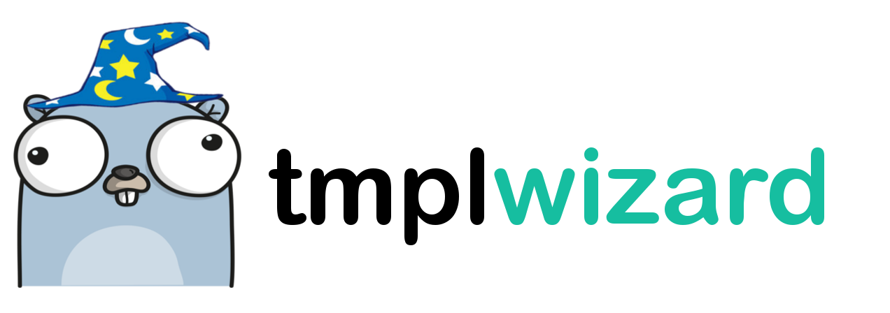

[](https://github.com/jakewarren/tmplwizard/releases])
[](https://github.com/jakewarren/tmplwizard/blob/master/LICENSE)
[](https://goreportcard.com/report/github.com/jakewarren/tmplwizard)
[](http://makeapullrequest.com)
> Generates an interactive wizard from prompts in a text/template template file

tmplwizard generates a cli wizard based on prompt functions in a template to allow the user to dynamically provide values. 
 
**Prompt Functions:**  
`PromptString` prompts the user for a string value which can be stored in a variable for later use in the template.  
`PromptBool` allows for conditional rendering of template sections.

## Install
### Option 1: Binary

Download the latest release from [https://github.com/jakewarren/tmplwizard/releases](https://github.com/jakewarren/tmplwizard/releases)

### Option 2: From source

```
go get github.com/jakewarren/tmplwizard
```

## Usage

Run the included example: `go run main.go examples/nested_conditionals.tmpl`

examples/nested_conditionals.tmpl:
```
{{$stringVariable := .PromptString "Enter any string: " -}}
The string you entered ({{$stringVariable}}) is now stored in a variable.

{{ if .PromptBool "Do you want to expand the first section ---> " -}}
This text appears if you confirm the first conditional.

{{ if .PromptBool "Do you want to expand the nested conditional ---> " -}}
This text only appears if you answered yes to both of the previous questions.
{{end -}}
{{end -}}

```

## Background

I created this project as a way to quickly scaffold out text files such as READMEs. There are probably other uses that I'm not thinking of.

## Changes

All notable changes to this project will be documented in the [changelog].

The format is based on [Keep a Changelog](http://keepachangelog.com/) and this
project adheres to [Semantic Versioning](http://semver.org/).

## License

MIT © 2017 Jake Warren

[changelog]:CHANGELOG.md